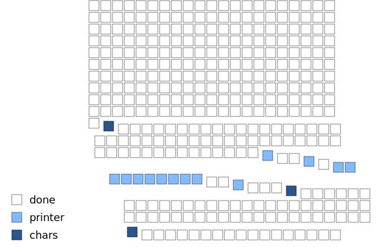

# `Language::Bel`


A Perl 5 implementation of Paul Graham's [Bel](http://www.paulgraham.com/bel.html).
Bel is a self-hosting Lisp dialect, released October 2019.

## Installation

You need [Perl](https://www.perl.org/get.html) installed.

Only possible to install `Language::Bel` through GitHub right now.

```sh
$ git clone https://github.com/masak/bel.git
Cloning into 'bel'...
[...]
done.
```

At some point soon, I'll also upload this distribution to CPAN.
Then you'll be able to install it using a CPAN installer, such as `cpanm`.

After downloading Bel, you can run it like this:

```sh
$ perl -Ilib bin/bel
Language::Bel 0.52 -- darwin.
>
> ;; loops
> (set n (len (apply append prims)))
16
> (each word `(there are ,n primitives) (prn word))
there
are
16
primitives
(there are 16 primitives)
>
> ;; sorting and de-duplication
> (sort < '(3 2 8 6 18 12 2 19 13 19))
(2 2 3 6 8 12 13 18 19 19)
> (dedup (sort < '(3 2 8 6 18 12 2 19 13 19)))
(2 3 6 8 12 13 18 19)
>
> ;; templates and places
> (tem vec2d x 0 y 0)
((x lit clo nil nil 0) (y lit clo nil nil 0))
> (set robot (make vec2d))
(lit tab (x . 0) (y . 0))
> robot!y
0
> (zap [+ 5 _] robot!y)
5
> robot!y
5
> (++ robot!y)
6
> ((of list robot) 'x 'y)
(0 6)
>
> ;; arrays
> (set I (array '(3 3) 0))
(lit arr (lit arr 0 0 0) (lit arr 0 0 0) (lit arr 0 0 0))
> (def diag (m n) (m n n))
(lit clo nil (m n) (m n n))
> (for n 1 3 (set (diag I n) 1))
nil
> I
(lit arr (lit arr 1 0 0) (lit arr 0 1 0) (lit arr 0 0 1))
```

## State of completion

`Language::Bel` intends to be a complete implementation of the Bel spec.
It's not fully there yet, though it's under active development.

[The spec](https://github.com/masak/bel/blob/master/pg/bel.bel) contains 353 items.
`Language::Bel` currently defines 343 of them.



A summary of the remaining big feature:

* **Printer**; there's a printer written in Perl already. It's largely
  feature-complete, but just like the evaluator and reader, it's not extensible
  enough. It also doesn't handle cyclic structures and named pairs, although it
  could do that.

## Contributing

If you'd like to contribute, please fork the repository and make changes as you'd like.
Pull requests are warmly welcome.

## License and copyright

This software is Copyright (c) 2019-2021 by Carl Mäsak.

This project is licensed under the GNU GPL 3.0.
For details, see [`LICENSE`](https://github.com/masak/bel/blob/master/LICENSE).
